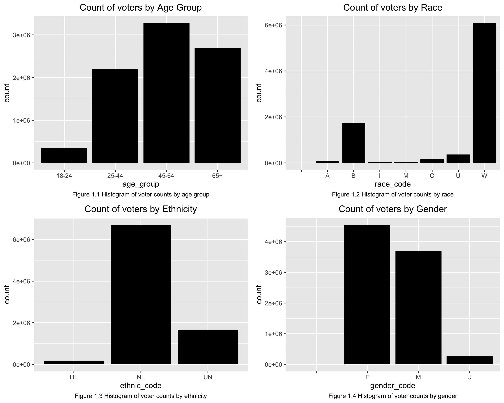

```{r, include=FALSE}
library(kableExtra)
```

# Introduction

Election forecasting is of great interest to many people. Politicians might use it to adjust campaign strategies, economists might use it to predict how markets will react, and citizens might use it to decide whether to vote. Many polls are carried out in an attempt to predict the winner of an election, however these polls often don't capture the whole picture. Polls can be biased, they can change over time, and perhaps most importantly, they don't always reveal who will show up to vote on election day. In order to have a more accurate election prediction model, voter turnout is a critical factor to consider. For example, if one candidate is predicted to win by a large margin in the polls, that might cause some people not to show up to vote on election day. Additionally, some polls include people who might not actually be registered to vote.

In this report, we seek to build a comprehensive model predicting who votes, specifically in the state of North Carolina. First, we will cover a brief literature review of other voter turnout models that have been constructed in the past. Next, we will discuss the data used to build our models. After that, we will walk through the construction of our model, and we will discuss our results.

# Literature Review

Previous studies have examined different ways of estimating who votes, but there does not appear to be any general consensus in the best way of modeling this. In one study (Wislek), the author attempts to predict voter turnout rates based on an area's violent crime rate, number of US House Representatives, and several other political factors. However, this data is examined at the state level, so there might be differences across counties that aren't being captured. 

Another paper by Challenor states the importance of likely voter models in election forecasting, and goes onto predict voter turnout based on US Census questions. They compared several models, the best of which had 87.82% accuracy, and determined that the features most correlated with voting included education level, marital status, and major job industry, while the variables with least correlated with voting were marital status based on armed forces participation, intermediate job industry, and age. 

In Grofman's paper, "Models of voter turnout: a brief idiosyncratic review," he examines many old studies about voting models, and some date back to as early as 1957. He says that the two main schools of thought in voter prediction modeling are  predicting turnout in terms of demographic or attitudinal factors and the other is estimating voter turnout by thinking of voting as a "rational choice calculus" where citizens estimate the costs and benefits of voting. In the end, he determines that both methods produce similar results: it is very hard to explain which individuals will vote or not, but models have found more success in predicting which categories of people vote depending on group characteristics and the election.


# Data

Several data sources were used to build the model. To start, we used information from the North Carolina voter registration database. The first dataset from this source was a file containing all registered voters in North Carolina. Each row represents an individual, and we also have their current voter status, the county they live in, the day they registered to vote, what political party they're a member of, as well as other demographic information like race, ethnicity, gender, and age. The second dataset from this source contained actual voting records from the 2016 and 2018 elections. Each row represents a vote, and includes other information like county, voter registration number, election, voting method, which party was voted for, and the precinct. 

To engineer an appropriate data set relevant to the research goals, we first merged both data sets together using the voting registration numbers to have a collective dataset with all the predictors relevant to the study. We then modified the ages of voters from their specific ages to age groups, so as to align with other census data, and allow for better interpretability of this predictor when perform model analysis. Finally, we grouped the data into different groups based on our factored predictors, resulting in a dataset with 30673 rows and 7 columns. Details of the predictor variables are described in Table 1.1.

```{r, echo=FALSE, warning=FALSE}
features_tbl <- data.frame(
  Metric = c(rep("n", 1),
             rep("race", 2),
             rep("gender",1),
             rep("ethnicity",1),
             rep("age group",1),
             rep("county",1),
             rep("election date",1)),
  
  Groups = linebreak(c("Number of voters",
                       "A = Asian, B = Black or African American, I = American Indian or Native American, ", 
                       "M = Two or more races , O = Other , U = Undesignated, W = White", 
                       "M = Male, F = Female, U = Preferred not to respond", 
                        "HL = Hispanic or Latino, NL = Non-hispanic/Non-Latino, UN = Undesignated",
                       "Age groups of 18-24, 25-44, 45-64, 65+",
                       "North Carolina's 100 counties",
                       "Election dates of 11/06/2018, 11/08/2016")
  )
)
features_tbl %>% 
  kable(escape=F,   booktabs = T, align = "c",
        caption = "Table 1.1 Description Table of Data set variables",) %>%
  kable_styling(latex_options = c("hold_position")) %>% 
  collapse_rows(columns = 1, latex_hline = "major") %>% 
  row_spec(0, bold = TRUE) #%>% 
#column_spec(column = c(2), latex_column_spec = "c")
```

Performing explanatory data analysis on the data set, we noted that there are unequal representation of certain groups within each predictor variables. Figures 1.1-1.4 show histograms of the counts of observations in terms of age group, race, ethnicity and gender. From these plots, we can observe that the majority of the observations that represent voters disproportionately identify their race as white, or identify their ethnicity as HL. We have slightly more female voters than male voters with little representation outside of these two specified genders, as well as having most of the voters between the ages of 45-64.




# Model

To build the model that predicts who votes specifically in the state of North Carolina, our approach involved using a binomial multi-level model to predict the number of voters based on groups in our predictor variables. We fit a simple logistic regression model with the response variable being the number of people who voted, and the predictor variables being race, ethnicity, election date (2016 and 2018), gender and county, with all predictors being factor variables. 

The model for race $i$, ethnicity $j$, election date $k$, gender $l$,county $m$ and age group $q$ to predict the number of people who voted $n_{voting,ijklm}$ can be written in statistical notation as:

$$
\begin{aligned}
    n_{voting,ijklq}  \sim Binomial(n_{ijklq}, p_{ijklq}) \\ \\
    logit(p_{ijklq}) = \alpha_{county} + \beta_1 * race_i + \beta_2* ethnicity_j + \beta_3 electiondate_k  \\ + \beta_4 * gender_l + \beta_5 * agegroup_q\\
    \\
    \alpha \sim N(0,1) ,  \beta_b \sim N(0,1)  
 \end{aligned}
$$

As a start, we are using N(0,1) for all intercepts and coefficients with prior motivations being the intuitive expectation for various factors to have equal effects on whether someone votes or not. Furthermore, in order to estimate the number of people who voted as a binomial probability, we give a number of "trials" using the number of registered voters in those groups as that number. This is so the predicted probabilities obtained from the model accurately reflect the proportion of registered voters who are actually voting. The baseline for our model predicts the number of people voting in the 2018 mid-term election that are white, female, non-Hispanic and in the age group of 18-24.

## Validation

# Results

When controlling for county as a random effect, we estimate the odds that a white, female, non-Hispanic female between the ages of 18-24 in North Carolina voted in the 2018 mid-term election is `r exp(-1.24)`. There are 100 different intercepts for the 100 counties in North Carolina, and these estimates have a standard deviation of 0.14. 

Holding all else constant, we estimate that the odds a given person voted in the 2016 election to be multiplied by a factor of `r exp(0.54)` than the odds they voted in the 2018 mid-term elections. It makes intuitive sense that the odds of voting in 2016 are higher, since it seems that more people tend to vote in presidential elections. This also suggests that using 2016 voting estimates could help us better determine voter turnout in 2020, since this is also a big presidential election. 

When examining gender effects, the odds that someone who identifies as male votes are `r exp(-0.07)` times the odds that someone who identifies as female votes, holding all else constant. This suggests that women are more likely to vote than men. Additionally, people who did not specify their gender when registering to vote are `r exp(0.40)` times more likely to vote than females, holding all else constant. 

Everything else held constant, the odds that someone votes given they are black is `r exp(0.01)` times the odds someone votes given they are white. If a person is Asian, American Indian, Multi-race, or something other, their respective odds of voting relative to someone white multiply by `r exp(-0.10)`, `r exp(-0.25)`, `r exp(0.13)`, and `r exp(-0.41)` respectively, holding all else constant. Lastly, for people who did not specify their race, their odds of voting are, holding all else constant, `r exp(-0.52)` times the odds of someone white voting.

In terms of ethnicity, the odds that someone votes given they are Hispanic or Latino is `r exp(-0.05)` times the odds of voting for someone who is not Hispanic or Latino, holding all else constant, and the odds of voting for someone who did not specify ethnicity are `r exp(-0.02)` times the odds of someone who is reportedly not Hispanic or Latino. 

Finally, we examine the effect of age on odds of voting. Holding all other variables constant, the odds of voting seems to increase with age until one reaches 65, then it decreases a bit. Specifically, the odds of voting for someone between the ages of 25 and 44 is `r exp(0.92)` times the odds of someone from 18-24 voting, the odds of voting for someone between the ages of 45 and 64 is `r exp(1.75)` times the odds of someone from 18-24 voting, and the odds of voting for someone over 65 is `r exp(1.56)` times the odds of someone from 18-24 voting.

All that being said, our model also includes lots of interaction effects. This means that the odds of voting vary differently depending on all the levels of our predictors. For example, our lowest interaction effect occurs when race and gender are both unspecified. This means that as we hold age, ethnicity, and election constant, we expect the odds of a person of unspecified race and gender's odds to multiply by an additional `r exp(-0.48)`, or by a total of `r exp(-0.48 + -0.52 + 0.40)` times the odds of a white female voting. One of our highest interaction effects occurs when gender is unspecified and when ethnicity is Hispanic or Latino. This means that as we hold age, race, and election constant, we expect the odds of a person of unspecified race and gender's odds to multiply by an additional `r exp(0.65)`, or by a total of `r exp(0.65 + 0.40 + -0.05)` times the odds of a white female voting.

# Citations

Can Likely U.S. Voter Models Be Improved? (2020, May 30). Retrieved October 22, 2020, from https://www.pewresearch.org/methods/2016/01/07/comparing-the-results-of-different-likely-voter-models/

Challenor, T. (2017, December 15). Predicting Votes From Census Data. Retrieved October 22, 2020, from http://cs229.stanford.edu/proj2017/final-reports/5232542.pdf

Grofman, B. (1983). Models of Voter Turnout: A Brief Idiosyncratic Review: A Comment. Public Choice, 41(1), 55-61. doi:https://www.jstor.org/stable/30024032?seq=1#metadata_info_tab_contents

Wislek, J. (n.d.). Predicting Voter Turnout. Retrieved October 22, 2020, from https://scholar.valpo.edu/cgi/viewcontent.cgi?article=1906&amp;context=cus


# Appendix


## Full Model Output
```{r}
var1 <- readRDS("whovotes_model_01var.rda.rds")
library(brms)
summary(var1)
```

